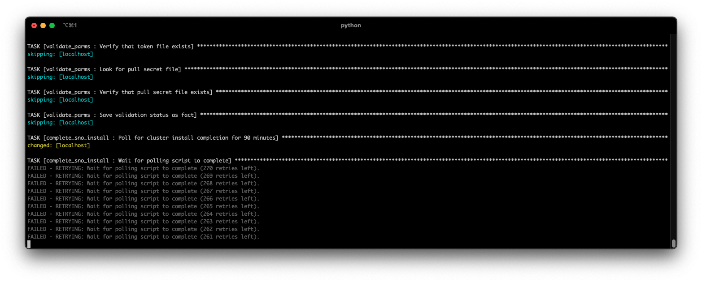
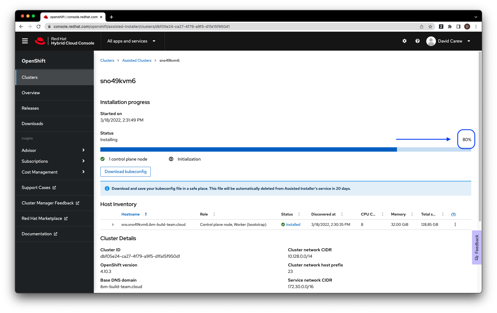

# Spin up a Single Node OpenShift Cluster on VMWare

This repository includes a collection of Ansible playbooks that provisions a Single Node OpenShift cluster on VMware using the Red Hat Assisted Installer Service.

The Ansible  modules provision the following resources on VMWare:


* Boot ISO for SNO Openshift Cluster VM
* VM for SNO Openshift Cluster
    

Running the master playbook to install the OpenShift Single Node cluster can be done with a single command but there are some prerequisites that must be in place before running that command.

## 1. Clone this repo

From a terminal window, clone this Github repo to your local system.

```bash
git clone https://github.ibm.com/hcbt/sno-on-azure-ansible.git
```

Go to the **ansible** sub-folder of the cloned repos root folder. **Note:** All subsequent command line instructions assume that you will be in this folder.

```bash
cd sno-on-vmware-ansible
cd ansible
```

## 1. Setup SNO Installer VMWare VM

It is recommended that you create a Linux VM in VMWare with Ubuntu 20.04 Server as the OS to serve as the SNO installer. Install the following software on the VM. After starting the VM access it via a terminal and install the following:

### 1.1 Install Ansible 2.9

The playbooks have only  been tested with Ansible 2.9 (the Red Hat supported version) so it is recommended to use 2.9 to avoid potential incompatibilities  with other versions.

The following table shows the install process for various Operating Systems:

| OS Family | Commands |
| --- | --- |
| Ubuntu/Debian | `sudo apt update`<br/>`sudo apt install software-properties-common`<br/>`sudo apt-add-repository --yes --update ppa:ansible/ansible`<br/>`sudo apt install ansible-2.9`|

### 1.2 Install Python PIP

Run the following command to install PIP

```bash
sudo apt install python3-pip -y
```

### 1.3 Install VMWare Ansible tasks

Run the following commands to install the VMWare ansible tasks:


```bash
pip3 install pyvmomi
```

### 1.4 Install wget, git

Run the following command to install wget and git 

```bash
sudo apt install -y wget git
```

### 1.5 Install jq

The jq utility is required to parse curl commands in the complete_sno_install step. The installation was tested with jq version 1.6.

| OS Family | Commands |
| --- | --- |
| Ubuntu/Debian | `sudo apt install jq -y`|


### 1.6 Install podman 

Run the following commands to install podman:

```bash
sudo bash
apt-get install wget -qq -y
sh -c "echo 'deb http://download.opensuse.org/repositories/devel:/kubic:/libcontainers:/stable/xUbuntu_20.04/ /' > /etc/apt/sources.list.d/devel:kubic:libcontainers:stable.list"
wget -nv https://download.opensuse.org/repositories/devel:kubic:libcontainers:stable/xUbuntu_${VERSION_ID}/Release.key -O- | apt-key add -
apt-get update -qq -y
apt-get -qq --yes install podman
```

### 1.7 Clone this repo

From a terminal window on the SNO INstaller Ubuntu VM , clone this Github repo.

```bash
git clone https://github.ibm.com/hcbt/sno-on-azure-ansible.git
```

Go to the **ansible** sub-folder of the cloned repos root folder. **Note:** All subsequent command line instructions assume that you will be in this folder.

```bash
cd sno-on-vmware-ansible
cd ansible
```

## 2. Start the assisted installer

### 2.1 Create directory for the  assisted installer

Run the following commands to create a directory for the Assisted installer

```bash
mkdir assisted-installer
cd assisted-installer
```

### 2.2 Get Assisted installer config files

Run the following commands to get the config files

```bash
wget -o config.yml https://raw.githubusercontent.com/openshift/assisted-service/master/deploy/podman/configmap.yml
wget -o pod.yml https://raw.githubusercontent.com/openshift/assisted-service/master/deploy/podman/pod.yml
```
### 2.3 Edit the Assisted installer config file

Edit the file `configmap.yml` and make the following changes:

* Change IMAGE_SERVICE_BASE_URL and SERVICE_BASE_URL to match to the hostname or IP address of your installer VMWare image.

### 2.4 Run the Assisted installer

Run the following commands to start the Assisted Installer

```bash
podman play kube --configmap configmap.yml pod.yml
```


## 3. Get required credentials and set playbook variables

The following table lists the credentials required by the playbooks. For the Azure Ansible tasks we use a Service Principal for authentication.

| Credential | How to obtain |
| --- | --- |
| OpenShift pull secret | If you don't have a Red Hat subscription for OpenShift, you can get a free Developer one [here](https://developers.redhat.com/articles/faqs-no-cost-red-hat-enterprise-linux).<br/> Once you have a subscription, download the pull secret [here](https://console.redhat.com/openshift/install/pull-secret). Note: make sure you use the `Download` option and not the `copy` option. The `copy` option removes the double quotes, which will be considered invalid JSON and cause the playbooks to fail.|


### 3.1 OpenShift Pull Secret

Copy the pull secret you downloaded in the previous step (*pull-secret.txt*) to the *ansible/auth* folder in the directory tree of your local copy of this GH repo.


#### 3.2 Required Playbook parameters

i. Create a copy of the file *ansible/group_vars/all.example* in the same folder, named *all*

```bash
cp group_vars/all.example group_vars/all
```

The `all` file looks as follows:

```yaml
---
name_prefix: "CHANGE_NAMEPREFIX"
sno_domain_name: "CHANGE_DOMAIN"
sno_cluster_name: "CHANGE_CLUSTERNAME"
sno_version: "4.10"
sno_dns_ip: "CHANGE SNO VM DNS IP"
sno_interface: "ens192"
sno_vm_vcpus: 8
sno_vm_ram_mb: 32768
sno_vm_disk_size: 120Gi
sno_mac_address: 00:50:56:b2:da:e4
sno_guest_id: rhel8_64Guest
sno_ip_address: "CHANGE SNO VM IP"
sno_gateway_ip: "CHANGE SNO VM GATEWAY IP"
sno_machine_cidr: "CHANGE SNO VM CIDR"
sno_iso_datastore: "CHANGE SNO VM ISO DATASTORE"
sno_iso_datastore_path: "CHANGE SNO ISO DATASTORE PATH"
sno_vm_datastore: "CHANGE SNO VM DISK DATASTORE"
vcenter_hostname: "CHANGE VCENTER HOSTNAME"
vcenter_datacenter: "CHANGE VCENTER DATACENTER"
vcenter_username: "CHANGE VCENTER USERNAME"
vcenter_password: "CHANGE VCENTER PASSWORD"
```

ii. Edit the file  *ansible/group_vars/all* replacing all the values set to `"*****change me*****"` with valid values. The table below gives more details about the required and optional parameters.

| Parameter | Type |  Description | Required | Default Value |
| --- | --- | --- | --- | --- |
| name_prefix | String | The prefix used for all Azure resources provisioned by the playbooks. Suffixes will be added to indicate the type of resource. For example `mynameprefix-rg` for a respource group  and `mynameprefix-vnet` for a virtual network instance etc. | Yes | None |
| sno_cluster_name | String | Name of OpenShift cluster to be used by the Assisted Installer API | Yes | None |
| sno_domain_name | String | Name of OpenShift cluster domain name to be used by the Assisted Installer API . The format should be a valid domain e.g. `example.com`  but it does not have to resolveable via public DNS servers | Yes | None |
| sno_version | String | OpenShift version to install. Valid values are "4.8","4.9" and "4.10" | No | "4.10" |
| sno_dns_ip | String | IP address of DNS server used by SNO cluster | Yes | None |
| sno_interface | String | Network interface name of SNO Cluster VM | No | ens192 | 
| sno_vm_cpus | Integer | Number of VCPU allocated to SNO Cluster VM | No | 8 | 
| sno_vm_ram_mb | Integer | Mb of RAM allocated to SNO Cluster VM | No | 32768 | 
| sno_vm_disk_size | String | Size of disk allocated to SNO Cluster VM | No | 120Gi |
| sno_mac_address | String | Mac address of primary network interface for SNO Cluster VM | No | 00:50:56:b2:da:e4 |
| sno_guest_id  | String | VMWare Guest Id for SNO Cluster VM  | No | rhel8_64Guest |
| sno_ip_address | String | IP address of SNO Cluster VM | Yes | None |
| sno_gateway_ip | String | Gateway IP of SNO Cluster VM | Yes | None |
| sno_machine_cidr | String | CIDR of SNO Cluster VM | Yes | None |
| sno_iso_datastore | String | VMWare ISO Datastore for SNO Cluster VM | Yes | None |
| sno_iso_datastore_path | String | VMWare ISO Datastore path for SNO Cluster VM | Yes | None |
| sno_vm_datastore | String | VMWare Disk Datastore for SNO Cluster VM | Yes | None |
| vcenter_hostname | String | vCenter hostname | Yes | None |
| vcenter_datacenter | String | vCenter datacenter | Yes | None |
| vcenter_username | String | vCenter username | Yes | None |
| vcenter_password | String | vCenter password | Yes | None |


### 3.3 Validate the parameters

Run the following playbook to validate the parameters

```bash
ansible-playbook validate_parms.yml  
```

You should see an output message that ends with the following

```bash
TASK [Success message] *************************************************************************************************************************************************************************************
ok: [localhost] => {
    "msg": "Parameter validation successful"
}

PLAY RECAP *************************************************************************************************************************************************************************************************
localhost                  : ok=12   changed=0    unreachable=0    failed=0    skipped=0    rescued=0    ignored=0
```

## 4. Running the master playbook and monitoring progress

In our testing the end to end process takes around 30-45 minutes although your mileage may vary depending on network speed Azure location etc.

### 4.1 Running the master playbook

Run the following command:

```bash
ansible-playbook quickstart.yml
```

### 4.2 Monitoring progress

Progress is displayed by Ansible via the terminal. The longest task is monitoring the Assisted Installer once the install of the cluster has been kicked off. Your screen will look like the following:

  
  <sub><sub>Figure 1. Polling the Assisted Installer</sub></sub>

Login to the Azure portal and browse your Azure resources [here](https://portal.azure.com/#home).

Login to the Assisted Installer portal [here](https://console.redhat.com/openshift/assisted-installer/clusters) to see more granular progress updates:

i. Select the corresponding cluster

  
  <sub><sub>Figure 2. Your clusters</sub></sub>

ii. View the progress . The overall install progress is shown  at the right of the screen.

  
  <sub><sub>Figure 3. Install progress</sub></sub>

### 4.3 Playbook termination

When the playbook completes the install the terminal window will look like the following. **Note:** If you selected  the GUI option for the KVM host install you will get additional details about accessing the KVM Host via VNC.

  
  <sub><sub>Figure 7. Access info </sub></sub>

## 5. Accessing the cluster

### 5.1 Access the cluster from  your local machine

Before you try to access your cluster, make sure the installation has completed.

To access your cluster from your local machine setup you need to do the following:

1. Add the contents of the file *auth/[your cluster name].hosts* to your local  */etc/hosts* file
1. Open the file *auth/[your cluster name]-kubeadmin.json* to see your cluster credentials
1. For browser access go to the URL https://console-openshift-console.apps.[your cluster name].[your cluster domain] and login with your cluster credentials.

    * For oc CLI acccess enter the following command,

    ```bash
    oc login api.[your cluster name].[your cluster domain]:6443
    ```

    * Enter your your cluster credentials when prompted

1. For SSH access to the KVM Host enter the following command:

    ```bash
    ssh -i auth/[your cluster name]-local-id_rsa  kvmadmin@kvmhost.[your cluster name].[your cluster domain]
    ```

1. For SSH access to your single OpenShift node enter the following command:

    ```bash
    ssh -i auth/[your cluster name]-remote-id_rsa  core@sno.[your cluster name].[your cluster domain] -p 8022
    ```

## 6. Uninstall the cluster

As long as you still have the the same *group_var/all* file that you used to install the cluster,  you can remove the cluster and all it's components by running the following command:

```bash
ansible-playbook teardown_vmware_host.yml
```

## Troubleshooting

### Timeout

A timeout failure may occur on some tasks depending on the latency of the network or time certain processes take.

```bash
TASK [create_sno_vm : Wait for VM to become reachable over SSH] **************************************************************************************************************************
fatal: [1.2.3.4]: FAILED! => {"changed": false, "elapsed": 190, "msg": "Timeout when waiting for 192.168.122.3:22"}
```

Solution: increase the timeout value in the relevant task, e.g. `Wait for VM to become reachable over SSH` in the relevant playbook, e.g. `create_sno_vm`.

```yaml
- name: Wait for VM to become reachable over SSH
  wait_for:
    host: "{{ sno_ip_address }}"
    port: 22
    delay: 20
    **timeout: 360**
    sleep: 10
    state: started
```
